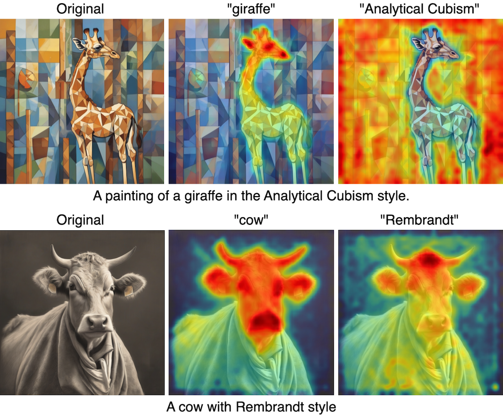

# 🐮 The Cow of Rembrandt: Analyzing Artistic Prompt Interpretation in Text-to-Image Models

<p align="center"></p>

<!--- [](https://doi.org/[DOI-NUMBER]) 
[](https://www.gnu.org/licenses/gpl-3.0) -->

This research investigates how text-to-image diffusion models internally represent artistic concepts like content and style when generating artworks. Using cross-attention analysis, we examine how these models separate content-describing and style-describing elements in prompts. Our findings reveal that diffusion models show varying degrees of content-style separation, with content tokens typically influencing object regions and style tokens affecting backgrounds and textures.

Explore the complete set of generated images [here](https://thecowofrembrandt.islab.di.unimi.it/)!

## Repository Structure

```
├── entities/                         # Data for populating prompt templates
├── output/                           # Experiments results
|   ├── prompts.csv                   # Prompts used for experiments
│   ├── content_style_iou_results.csv # IoU results of the experiments
├── src/                              # Source code
│   ├── analysis_utils.py             # Metrics computation
│   ├── config.py                     # Experiment settings
│   ├── data_utils.py                 # Prompt handling
│   ├── main_exp.py                   # Main experiment
│   ├── main_viz.py                   # Main visualization
│   └── model_utils.py                # Model setup
├── result_analysis.ipynb             # Jupyter notebook for replicating plots and analysis
├── requirements.txt                  # Python dependencies
└── README.md                         # This file
```

## Installation

### Prerequisites

- Python 3.10.5

### Setup

1. Clone the repository:
```bash
git clone https://github.com/umilISLab/artistic-prompt-interpretation.git
cd artistic-prompt-interpretation
```

2. Create a virtual environment:
```bash
python -m venv venv
source venv/bin/activate  # On Windows: venv\Scripts\activate
```

3. Install dependencies:
```bash
pip install -r requirements.txt
```

## Usage

### Reproducing Results

To reproduce the main results from the paper:

```bash
python src/main_exp.py
python src/main_viz.py
```

## Data

### Entities

The entities used for populating the prompts have been taken from:
- [Objects](https://github.com/amikelive/coco-labels/blob/master/coco-labels-2014_2017.txt)
- [Artists](https://github.com/cs-chan/ArtGAN/blob/master/WikiArt%20Dataset/Artist/artist_class)
- [Movements](https://github.com/cs-chan/ArtGAN/blob/master/WikiArt%20Dataset/Style/style_class.txt)

<!-- ### Data Availability

The complete set of generated images can be downloaded from here. -->

<!-- ## Citation

If you use this code or find our work helpful, please cite:

```bibtex
@article{[citation-key],
  title={[Paper Title]},
  author={[Author Names]},
  journal={[Journal Name]},
  year={[Year]},
  volume={[Volume]},
  number={[Number]},
  pages={[Pages]},
  doi={[DOI]}
}
``` -->
